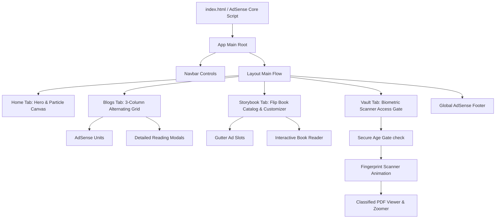

# LuminaTales 🌌

Welcome to **LuminaTales**, an immersive, highly animated blog, interactive storybook, and restricted-access archive vault designed with a premium dark cyberpunk aesthetic.

[](LICENSE)
[](https://vite.dev)
[](https://react.dev)

---

## 🚀 Key Features

* **Interactive landing section (Hero):** Floating status badges, custom particle canvas background with dynamic vectors, and fluid responsive grid layers.
* **Chronicles & logs (Blogs):** Strict 3-column grid structure with a detailed reading layout, tags, category sorting, search features, and checkerboard ad unit placements.
* **3D Flip-Book Reader (Storybook):** Implements a physical-book feel featuring page turn simulations, text resizing, paper-sepia/cyber-grid/neon-synth theme customizers, and vertical gutter ads.
* **Biometric Vault (Restricted Archive):** Features a simulated fingerprint scanner, age-gate checklist verification, access levels (Restricted, Secret, Top Secret), and an interactive PDF decrypter reader with custom zoom options.
* **Monetization-Ready:** Pre-configured Google AdSense integration throughout the platform (footer, alternating list cards, and reader margins).
* **Performance Tuned:** GPU layers promoted and particle counts optimized to eliminate scroll latency.

---

## 📊 System Architecture Flow

Here is how the application layout and data state flow between sections:



---

## 🛠️ Technology Stack

* **Build Tool:** Vite
* **Frontend Library:** React (TypeScript)
* **Icons:** Lucide React
* **Styling System:** Vanilla CSS (optimized with custom keyframe animations, glowing effects, and responsive layout constraints)
* **Data Layer:** Pre-rendered generated mock database featuring 120 detailed items (40 Blogs, 40 Stories, 40 Vault documents)

---

## 💻 Getting Started

### Prerequisites

* Node.js (v18 or higher recommended)
* npm or yarn

### Installation

1. Clone the repository:
   ```bash
   git clone https://github.com/mscreations2309/LuminaTales.git
   cd LuminaTales
   ```

2. Install dependencies:
   ```bash
   npm install
   ```

3. Run the development server locally:
   ```bash
   npm run dev
   ```
   Open your browser to the local URL (usually `http://localhost:5173`).

4. Build the production output bundle:
   ```bash
   npm run build
   ```
